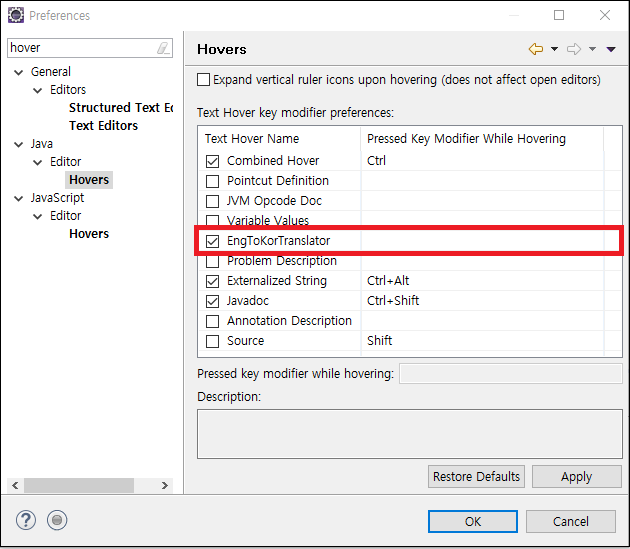

# dictionary

디컴파일을 할 때 로직 자체를 바로 보는 것보다는 주석을 보는 것이 더 이해가 빨라 주석을 자주 보는 편입니다.
대부분 주석이 영어이기 때문에, 크롬의 네이버 사전 플러그인 처럼 바로 화면에서 영문 뜻을 볼 수 있으면 어떨까 하는 생각에 개발하였습니다.

자바 에디터에서 클래스 혹은 메소드에 마우스를 올리면 Javadoc이 노란색 바탕의 팝업이 뜨면서 보이는 것을 볼 수 있습니다. 이 기능을 Hover 라고 합니다.
마우스를 올렸을 때 Hover가 뜨면서, 영어의 한글 뜻 및 간단한 설명이 나오도록 만들었습니다.

사전은 glosbe라는 오픈 API를 활용하여 한글 데이터를 가져옵니다(다소, 불안정안 사전입니다. 다른 오픈 API는 횟수 제한이 있어서 이 API를 사용하였습니다)
다른 API를 사용하고 싶은 분들을 위해 확장점을 구현 해놓았습니다. 확장점 구현 방법은 소스의 확장점 스키마를 참고 바랍니다.

복잡한 기능도 아니고, 구현 소스도 굉장히 간략하므로 간단히 플러그인 사용 방법만 설명 드리겠습니다.

1. dictionary.package 하위 바이너리를 이클립스에 설치합니다.
2. window -> Preference에 hover로 검색하여 Java/Editor/Hovers를 선택합니다.
3. 메인 화면에 EngToKorTranslator 라는 Text Hover를 선택합니다. 단, 다른 선택된 Hover들과 중복되지 않도록 단축키를 설정합니다.
(다른 선택된 Hover에 모두 단축키가 설정되어 있다면, 단축키를 설정 안해도 됩니다.)

4. 사전이 정상적으로 동작하는지 자바 에디터를 활성화 한 후 마우스를 올려봅니다.

2018.07.23

사전을 옵션화 하도록 확장점 재구현 및 Preference page를 추가 하였습니다.

TODO 작업
1. 네이버 Open API를 활용한 사전 구현 완료.

참고
glosbe API : https://glosbe.com/a-api